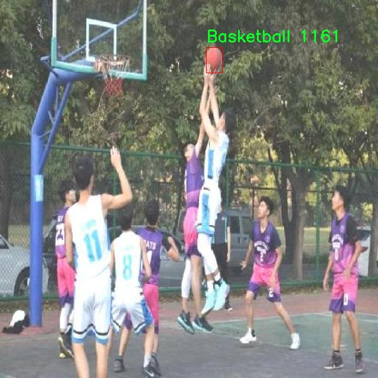

# 球类物体检测系统源码分享
 # [一条龙教学YOLOV8标注好的数据集一键训练_70+全套改进创新点发刊_Web前端展示]

### 1.研究背景与意义

项目参考[AAAI Association for the Advancement of Artificial Intelligence](https://gitee.com/qunmasj/projects)

项目来源[AACV Association for the Advancement of Computer Vision](https://kdocs.cn/l/cszuIiCKVNis)

研究背景与意义

随着计算机视觉技术的迅猛发展，物体检测在各个领域的应用日益广泛，尤其是在体育领域。球类运动作为全球最受欢迎的体育活动之一，涉及多种类型的球类，如足球、篮球、排球等。准确、高效地检测和识别这些球类物体，不仅能够提升运动分析的准确性，还能为智能体育系统的开发提供重要支持。因此，基于改进YOLOv8的球类物体检测系统的研究具有重要的理论和实际意义。

YOLO（You Only Look Once）系列模型以其高效的实时检测能力和良好的检测精度而受到广泛关注。YOLOv8作为该系列的最新版本，进一步优化了模型的结构和算法，提升了对小物体和复杂场景的检测能力。然而，现有的YOLOv8模型在特定场景下的应用仍存在一定的局限性，尤其是在多类别球类物体的检测任务中。为了克服这些局限性，改进YOLOv8模型以适应球类物体的特征，成为了当前研究的重点。

本研究所使用的数据集包含5000张图像，涵盖了五种不同类别的球类物体：足球、篮球、蓝色篮球、红色篮球和排球。这一多样化的数据集为模型的训练和测试提供了丰富的样本，有助于提高模型的泛化能力和准确性。通过对不同颜色和类型的篮球进行分类，可以深入探讨模型在处理颜色变化和形状多样性方面的表现。这不仅有助于提高模型的检测精度，还能为后续的应用场景提供更为全面的支持。

在实际应用中，基于改进YOLOv8的球类物体检测系统可以广泛应用于智能体育分析、比赛视频回放、运动员训练辅助等多个领域。例如，在比赛中，通过实时检测球类物体，可以为教练和运动员提供即时反馈，帮助他们更好地分析比赛策略和运动表现。此外，该系统还可以用于开发智能裁判系统，提高比赛的公正性和准确性。

综上所述，基于改进YOLOv8的球类物体检测系统的研究，不仅具有重要的学术价值，也为实际应用提供了有力的支持。通过对球类物体的高效检测与识别，可以推动智能体育的发展，提升运动分析的智能化水平，为未来的体育科技创新奠定基础。因此，本研究的开展将为计算机视觉领域的物体检测技术提供新的思路和方法，同时也为体育行业的数字化转型贡献力量。

### 2.图片演示


##### 注意：由于此博客编辑较早，上面“2.图片演示”和“3.视频演示”展示的系统图片或者视频可能为老版本，新版本在老版本的基础上升级如下：（实际效果以升级的新版本为准）

  （1）适配了YOLOV8的“目标检测”模型和“实例分割”模型，通过加载相应的权重（.pt）文件即可自适应加载模型。

  （2）支持“图片识别”、“视频识别”、“摄像头实时识别”三种识别模式。

  （3）支持“图片识别”、“视频识别”、“摄像头实时识别”三种识别结果保存导出，解决手动导出（容易卡顿出现爆内存）存在的问题，识别完自动保存结果并导出到tempDir中。

  （4）支持Web前端系统中的标题、背景图等自定义修改，后面提供修改教程。

  另外本项目提供训练的数据集和训练教程,暂不提供权重文件（best.pt）,需要您按照教程进行训练后实现图片演示和Web前端界面演示的效果。

### 3.视频演示

[3.1 视频演示](https://www.bilibili.com/video/BV1Wq1kYmEzT/)

### 4.数据集信息展示

##### 4.1 本项目数据集详细数据（类别数＆类别名）

nc: 5
names: ['Basketball', 'Blue-Basketball', 'Red-Basketball', 'Volleyball', 'football']


##### 4.2 本项目数据集信息介绍

数据集信息展示

在现代计算机视觉领域，物体检测技术的不断进步使得各种应用场景得以实现，尤其是在体育领域，球类物体的检测与识别显得尤为重要。本研究旨在改进YOLOv8模型，以提升其在球类物体检测任务中的性能。为此，我们构建了一个名为“Ball Object Detection”的数据集，专门用于训练和评估该系统的有效性。

“Ball Object Detection”数据集包含五个类别的球类物体，具体包括：篮球、蓝色篮球、红色篮球、排球和足球。这些类别的选择不仅考虑了球类运动的多样性，也兼顾了不同颜色和样式的球体，以确保模型在多种环境下的适应性和准确性。数据集中每个类别的样本数量经过精心设计，以确保模型在训练过程中能够充分学习到每种球类的特征，从而在实际应用中表现出色。

在数据集的构建过程中，我们收集了大量的图像数据，涵盖了不同的场景、光照条件和背景。这些图像不仅来自于专业的体育赛事，还包括了业余活动和训练场景，以增强模型的泛化能力。每张图像都经过精确的标注，确保每个球类物体的边界框和类别信息准确无误。这种高质量的标注工作为后续的模型训练提供了坚实的基础。

为了提高数据集的多样性，我们还进行了数据增强处理，包括旋转、缩放、裁剪和颜色变换等。这些技术不仅增加了数据集的样本数量，还有效提升了模型对不同变换的鲁棒性，使其能够在真实世界中更好地识别和定位球类物体。此外，数据集中的图像也涵盖了不同的视角和距离，使得模型能够在各种条件下进行有效的检测。

在训练过程中，我们将“Ball Object Detection”数据集与YOLOv8模型相结合，利用其先进的特征提取和目标检测能力，旨在实现更高的检测精度和更快的推理速度。通过对模型的反复训练和调优，我们期望能够显著提升其在实际应用中的表现，尤其是在复杂场景下的球类物体检测。

总之，“Ball Object Detection”数据集的构建不仅为YOLOv8模型的改进提供了必要的数据支持，也为未来的研究提供了宝贵的资源。随着球类物体检测技术的不断发展，我们相信这一数据集将为推动相关领域的进步做出重要贡献。通过持续的研究和创新，我们期待能够在体育分析、智能监控和人机交互等多个领域实现更广泛的应用。





### 5.全套项目环境部署视频教程（零基础手把手教学）

[5.1 环境部署教程链接（零基础手把手教学）](https://www.ixigua.com/7404473917358506534?logTag=c807d0cbc21c0ef59de5)


[5.2 安装Python虚拟环境创建和依赖库安装视频教程链接（零基础手把手教学）](https://www.ixigua.com/7404474678003106304?logTag=1f1041108cd1f708b01a)

### 6.手把手YOLOV8训练视频教程（零基础小白有手就能学会）

[6.1 手把手YOLOV8训练视频教程（零基础小白有手就能学会）](https://www.ixigua.com/7404477157818401292?logTag=d31a2dfd1983c9668658)


按照上面的训练视频教程链接加载项目提供的数据集，运行train.py即可开始训练



     Epoch   gpu_mem       box       obj       cls    labels  img_size
     1/200     20.8G   0.01576   0.01955  0.007536        22      1280: 100%|██████████| 849/849 [14:42<00:00,  1.04s/it]
               Class     Images     Labels          P          R     mAP@.5 mAP@.5:.95: 100%|██████████| 213/213 [01:14<00:00,  2.87it/s]
                 all       3395      17314      0.994      0.957      0.0957      0.0843

     Epoch   gpu_mem       box       obj       cls    labels  img_size
     2/200     20.8G   0.01578   0.01923  0.007006        22      1280: 100%|██████████| 849/849 [14:44<00:00,  1.04s/it]
               Class     Images     Labels          P          R     mAP@.5 mAP@.5:.95: 100%|██████████| 213/213 [01:12<00:00,  2.95it/s]
                 all       3395      17314      0.996      0.956      0.0957      0.0845

     Epoch   gpu_mem       box       obj       cls    labels  img_size
     3/200     20.8G   0.01561    0.0191  0.006895        27      1280: 100%|██████████| 849/849 [10:56<00:00,  1.29it/s]
               Class     Images     Labels          P          R     mAP@.5 mAP@.5:.95: 100%|███████   | 187/213 [00:52<00:00,  4.04it/s]
                 all       3395      17314      0.996      0.957      0.0957      0.0845


### 7.70+种全套YOLOV8创新点代码加载调参视频教程（一键加载写好的改进模型的配置文件）

[7.1 70+种全套YOLOV8创新点代码加载调参视频教程（一键加载写好的改进模型的配置文件）](https://www.ixigua.com/7404478314661806627?logTag=29066f8288e3f4eea3a4)

### 8.70+种全套YOLOV8创新点原理讲解（非科班也可以轻松写刊发刊，V10版本正在科研待更新）

#### 由于篇幅限制，每个创新点的具体原理讲解就不一一展开，具体见下列网址中的创新点对应子项目的技术原理博客网址【Blog】：


[8.1 70+种全套YOLOV8创新点原理讲解链接](https://gitee.com/qunmasj/good)

#### 部分改进原理讲解(完整的改进原理见上图和技术博客链接)
### YOLOv8简介

YOLOv8 是 Ultralytics 公司继 YOLOv5 算法之后开发的下一代算法模型，目前支持图像分类、物体检测和实例分割任务。YOLOv8 是一个 SOTA 模型，它建立在之前YOLO 系列模型的成功基础上，并引入了新的功能和改进，以进一步提升性能和灵活性。具体创新包括：一个新的骨干网络、一个新的 Ancher-Free 检测头和一个新的损失函数，可以在从 CPU 到 GPU 的各种硬件平台上运行。注意到ultralytics 并没有直接将开源库命名为 YOLOv8，而是直接使用 Ultralytics这个单词，原因是Ultralytics这个库的定位是算法框架，而非特指某一个特定算法，其希望这个库不仅仅能够用于 YOLO 系列模型，同时也能支持其他的视觉任务如图像分类、实例分割等。下图画图YOLOv8目标检测算法同其他YOLO系列算法（YOLOv5、6、7）的实验对比图，左边是模型参数量对比，右边是速度对比。


下面两个表分别是YOLOv8和YOLOv5（v7.0版本）官方在 COCO Val 2017 数据集上测试结果，从中看出 YOLOv8 相比 YOLOv5 精度提升大，但是 N/S/M 模型相应的参数量、FLOPS等提高了不少。


#### YOLOv8概述
提供了一个全新的SOTA模型，和YOLOv5一样，基于缩放系数也提供了 N/S/M/L/X 尺度的不同大小模型，用于满足不同场景需求，同时支持图像分类、目标检测、实例分割和姿态检测任务
在骨干网络和Neck部分将YOLOv5的C3结构换成了梯度流更丰富的 C2f 结构，并对不同尺度模型调整了不同的通道数，大幅提升了模型性能；需要注意的是C2f 模块中存在Split等操作对特定硬件部署没有之前那么友好


Head部分换成了目前主流的解耦头结构，将分类和检测头分离，同时也从 Anchor-Based换成了Anchor-Free Loss
计算方面采用了 TaskAlignedAssigner 正样本分配策略，并引入了 Distribution Focal Loss
下图画出YOLOv8目标检测算法的整体结构图


#### YOLOv8模型
YOLOv8目标检测算法的模型配置文件如下：


从配置文件可以看出，YOLOv8与YOLOv5模型最明显的差异是使用C2F模块替换了原来的C3模块，两个模块的结构图下图所示。


另外Head 部分变化最大，从原先的耦合头变成了解耦头，并且从 YOLOv5 的 Anchor-Based 变成了 Anchor-Free。其结构对比图如下所示：

### RepViT简介

近年来，与轻量级卷积神经网络(cnn)相比，轻量级视觉变压器(ViTs)在资源受限的移动设备上表现出了更高的性能和更低的延迟。这种改进通常归功于多头自注意模块，它使模型能够学习全局表示。然而，轻量级vit和轻量级cnn之间的架构差异还没有得到充分的研究。在这项研究中，我们重新审视了轻量级cnn的高效设计，并强调了它们在移动设备上的潜力。通过集成轻量级vit的高效架构选择，我们逐步增强了标准轻量级CNN的移动友好性，特别是MobileNetV3。这就产生了一个新的纯轻量级cnn家族，即RepViT。大量的实验表明，RepViT优于现有的轻型vit，并在各种视觉任务中表现出良好的延迟。在ImageNet上，RepViT在iPhone 12上以近1ms的延迟实现了超过80%的top-1精度，据我们所知，这是轻量级模型的第一次。

#### RepViT简介
轻量级模型研究一直是计算机视觉任务中的一个焦点，其目标是在降低计算成本的同时达到优秀的性能。轻量级模型与资源受限的移动设备尤其相关，使得视觉模型的边缘部署成为可能。在过去十年中，研究人员主要关注轻量级卷积神经网络（CNNs）的设计，提出了许多高效的设计原则，包括可分离卷积 、逆瓶颈结构 、通道打乱 和结构重参数化等，产生了 MobileNets ，ShuffleNets和 RepVGG 等代表性模型。

另一方面，视觉 Transformers（ViTs）成为学习视觉表征的另一种高效方案。与 CNNs 相比，ViTs 在各种计算机视觉任务中表现出了更优越的性能。然而，ViT 模型一般尺寸很大，延迟很高，不适合资源受限的移动设备。因此，研究人员开始探索 ViT 的轻量级设计。许多高效的ViTs设计原则被提出，大大提高了移动设备上 ViTs 的计算效率，产生了EfficientFormers ，MobileViTs等代表性模型。这些轻量级 ViTs 在移动设备上展现出了相比 CNNs 的更强的性能和更低的延迟。

轻量级 ViTs 优于轻量级 CNNs 的原因通常归结于多头注意力模块，该模块使模型能够学习全局表征。然而，轻量级 ViTs 和轻量级 CNNs 在块结构、宏观和微观架构设计方面存在值得注意的差异，但这些差异尚未得到充分研究。这自然引出了一个问题：轻量级 ViTs 的架构选择能否提高轻量级 CNN 的性能？在这项工作中，我们结合轻量级 ViTs 的架构选择，重新审视了轻量级 CNNs 的设计。我们的旨在缩小轻量级 CNNs 与轻量级 ViTs 之间的差距，并强调前者与后者相比在移动设备上的应用潜力。


在 ConvNeXt 中，参考该博客提出的基于 ResNet50 架构的基础上通过严谨的理论和实验分析，最终设计出一个非常优异的足以媲美 Swin-Transformer 的纯卷积神经网络架构。同样地，RepViT也是主要通过将轻量级 ViTs 的架构设计逐步整合到标准轻量级 CNN，即MobileNetV3-L，来对其进行针对性地改造（魔改）。在这个过程中，作者们考虑了不同粒度级别的设计元素，并通过一系列步骤达到优化的目标。


详细优化步骤如下：

#### 训练配方的对齐
论文中引入了一种衡量移动设备上延迟的指标，并将训练策略与现有的轻量级 ViTs 对齐。这一步骤主要是为了确保模型训练的一致性，其涉及两个概念，即延迟度量和训练策略的调整。

#### 延迟度量指标
为了更准确地衡量模型在真实移动设备上的性能，作者选择了直接测量模型在设备上的实际延迟，以此作为基准度量。这个度量方法不同于之前的研究，它们主要通过FLOPs或模型大小等指标优化模型的推理速度，这些指标并不总能很好地反映在移动应用中的实际延迟。

#### 训练策略的对齐
这里，将 MobileNetV3-L 的训练策略调整以与其他轻量级 ViTs 模型对齐。这包括使用 AdamW 优化器-ViTs 模型必备的优化器，进行 5 个 epoch 的预热训练，以及使用余弦退火学习率调度进行 300 个 epoch 的训练。尽管这种调整导致了模型准确率的略微下降，但可以保证公平性。

#### 块设计的优化
基于一致的训练设置，作者们探索了最优的块设计。块设计是 CNN 架构中的一个重要组成部分，优化块设计有助于提高网络的性能。

#### 分离 Token 混合器和通道混合器
这块主要是对 MobileNetV3-L 的块结构进行了改进，分离了令牌混合器和通道混合器。原来的 MobileNetV3 块结构包含一个 1x1 扩张卷积，然后是一个深度卷积和一个 1x1 的投影层，然后通过残差连接连接输入和输出。在此基础上，RepViT 将深度卷积提前，使得通道混合器和令牌混合器能够被分开。为了提高性能，还引入了结构重参数化来在训练时为深度滤波器引入多分支拓扑。最终，作者们成功地在 MobileNetV3 块中分离了令牌混合器和通道混合器，并将这种块命名为 RepViT 块。

#### 降低扩张比例并增加宽度
在通道混合器中，原本的扩张比例是 4，这意味着 MLP 块的隐藏维度是输入维度的四倍，消耗了大量的计算资源，对推理时间有很大的影响。为了缓解这个问题，我们可以将扩张比例降低到 2，从而减少了参数冗余和延迟，使得 MobileNetV3-L 的延迟降低到 0.65ms。随后，通过增加网络的宽度，即增加各阶段的通道数量，Top-1 准确率提高到 73.5%，而延迟只增加到 0.89ms！

#### 宏观架构元素的优化
在这一步，本文进一步优化了MobileNetV3-L在移动设备上的性能，主要是从宏观架构元素出发，包括 stem，降采样层，分类器以及整体阶段比例。通过优化这些宏观架构元素，模型的性能可以得到显著提高。

#### 浅层网络使用卷积提取器
ViTs 通常使用一个将输入图像分割成非重叠补丁的 “patchify” 操作作为 stem。然而，这种方法在训练优化性和对训练配方的敏感性上存在问题。因此，作者们采用了早期卷积来代替，这种方法已经被许多轻量级 ViTs 所采纳。对比之下，MobileNetV3-L 使用了一个更复杂的 stem 进行 4x 下采样。这样一来，虽然滤波器的初始数量增加到24，但总的延迟降低到0.86ms，同时 top-1 准确率提高到 73.9%。

#### 更深的下采样层
在 ViTs 中，空间下采样通常通过一个单独的补丁合并层来实现。因此这里我们可以采用一个单独和更深的下采样层，以增加网络深度并减少由于分辨率降低带来的信息损失。具体地，作者们首先使用一个 1x1 卷积来调整通道维度，然后将两个 1x1 卷积的输入和输出通过残差连接，形成一个前馈网络。此外，他们还在前面增加了一个 RepViT 块以进一步加深下采样层，这一步提高了 top-1 准确率到 75.4%，同时延迟为 0.96ms。

#### 更简单的分类器
在轻量级 ViTs 中，分类器通常由一个全局平均池化层后跟一个线性层组成。相比之下，MobileNetV3-L 使用了一个更复杂的分类器。因为现在最后的阶段有更多的通道，所以作者们将它替换为一个简单的分类器，即一个全局平均池化层和一个线性层，这一步将延迟降低到 0.77ms，同时 top-1 准确率为 74.8%。

#### 整体阶段比例
阶段比例代表了不同阶段中块数量的比例，从而表示了计算在各阶段中的分布。论文选择了一个更优的阶段比例 1:1:7:1，然后增加网络深度到 2:2:14:2，从而实现了一个更深的布局。这一步将 top-1 准确率提高到 76.9%，同时延迟为 1.02 ms。

#### 卷积核大小的选择
众所周知，CNNs 的性能和延迟通常受到卷积核大小的影响。例如，为了建模像 MHSA 这样的远距离上下文依赖，ConvNeXt 使用了大卷积核，从而实现了显著的性能提升。然而，大卷积核对于移动设备并不友好，因为它的计算复杂性和内存访问成本。MobileNetV3-L 主要使用 3x3 的卷积，有一部分块中使用 5x5 的卷积。作者们将它们替换为3x3的卷积，这导致延迟降低到 1.00ms，同时保持了76.9%的top-1准确率。

#### SE 层的位置
自注意力模块相对于卷积的一个优点是根据输入调整权重的能力，这被称为数据驱动属性。作为一个通道注意力模块，SE层可以弥补卷积在缺乏数据驱动属性上的限制，从而带来更好的性能。MobileNetV3-L 在某些块中加入了SE层，主要集中在后两个阶段。然而，与分辨率较高的阶段相比，分辨率较低的阶段从SE提供的全局平均池化操作中获得的准确率提升较小。作者们设计了一种策略，在所有阶段以交叉块的方式使用SE层，从而在最小的延迟增量下最大化准确率的提升，这一步将top-1准确率提升到77.4%，同时延迟降低到0.87ms。

注意！【这一点其实百度在很早前就已经做过实验比对得到过这个结论了，SE 层放置在靠近深层的地方效果好】

#### 微观设计的调整
RepViT 通过逐层微观设计来调整轻量级 CNN，这包括选择合适的卷积核大小和优化挤压-激励（Squeeze-and-excitation，简称SE）层的位置。这两种方法都能显著改善模型性能。

#### 网络架构
最终，通过整合上述改进策略，我们便得到了模型RepViT的整体架构，该模型有多个变种，例如RepViT-M1/M2/M3。同样地，不同的变种主要通过每个阶段的通道数和块数来区分。


### 9.系统功能展示（检测对象为举例，实际内容以本项目数据集为准）

图9.1.系统支持检测结果表格显示

  图9.2.系统支持置信度和IOU阈值手动调节

  图9.3.系统支持自定义加载权重文件best.pt(需要你通过步骤5中训练获得)

  图9.4.系统支持摄像头实时识别

  图9.5.系统支持图片识别

  图9.6.系统支持视频识别

  图9.7.系统支持识别结果文件自动保存

  图9.8.系统支持Excel导出检测结果数据


### 10.原始YOLOV8算法原理

原始YOLOv8算法原理

YOLOv8算法是YOLO系列目标检测算法的最新版本，由Glenn-Jocher提出，延续了YOLOv3和YOLOv5的设计理念，并在此基础上进行了多项重要改进。YOLO系列算法以其单阶段检测的高效性而闻名，YOLOv8更是在检测精度和速度上达到了新的高度。其核心结构主要由输入层、Backbone骨干网络、Neck特征融合网络和Head检测模块四个部分组成，形成了一个完整的目标检测体系。

在数据预处理方面，YOLOv8延续了YOLOv5的策略，采用了多种增强手段以提高模型的鲁棒性和泛化能力。具体而言，YOLOv8在训练过程中引入了马赛克增强、混合增强、空间扰动和颜色扰动等技术。这些技术不仅丰富了训练样本的多样性，还有效地减少了模型对特定数据分布的依赖，从而提升了检测的准确性。

YOLOv8的骨干网络结构在YOLOv5的基础上进行了优化，主要通过引入C2f模块来替代原有的C3模块。C2f模块的设计使得网络在特征提取过程中能够实现更丰富的梯度流动，这对于深层网络的训练尤为重要。C2f模块通过增加分支的数量，增强了特征的多样性，使得网络在处理复杂场景时能够提取到更多的有效信息。此外，YOLOv8在不同尺度的模型中灵活调整通道数，以适应不同的计算需求和应用场景，保持了轻量级特性。

在特征融合方面，YOLOv8继续采用FPN（特征金字塔网络）和PAN（路径聚合网络）的结合结构。这种结构有效地促进了多尺度信息的融合，使得网络能够在不同尺度上捕捉到丰富的语义和定位特征。通过将FPN与PAN结合，YOLOv8能够在特征提取的不同阶段进行有效的信息传递，从而增强了网络对不同尺度目标的检测能力。这种设计不仅提高了模型的性能，还在一定程度上简化了网络结构，使得模型在实际应用中更加高效。

在检测模块方面，YOLOv8采用了解耦头的结构，这一设计理念源于YOLOX的创新。解耦头将分类和定位任务分离为两个并行的分支，分别负责提取类别特征和位置特征。通过这种方式，YOLOv8能够更快地收敛，并提高了检测的精度。每个分支都使用一层1×1的卷积来完成各自的任务，这种解耦的设计不仅提升了模型的灵活性，还使得模型在处理复杂场景时能够更好地应对不同的目标检测需求。

YOLOv8在标签分配策略上也进行了创新，采用了与YOLOv6相同的TOOD策略。这种动态标签分配策略使得模型在处理正负样本时更加灵活，避免了传统方法中可能出现的候选框不准确的问题。YOLOv8的损失函数主要由类别损失和位置损失两部分组成，其中类别损失采用了VFL Loss（Varifocal Loss），而位置损失则结合了CIoU Loss和DFL Loss。VFL Loss通过对正负样本进行加权，增强了模型对高质量样本的关注，从而提高了检测的精度。

在YOLOv8的轻量化版本YOLOv8n中，进一步优化了网络结构，使其在保持高效性的同时，减少了计算资源的消耗。YOLOv8n通过使用更轻量化的C2F模块替代C3模块，并在特征融合层减少降采样层的数量，进一步提升了模型的速度和效率。此外，YOLOv8n的特征融合网络引入了BiFPN（双向特征金字塔网络），通过高效的双向跨尺度连接和加权特征融合，显著提高了模型对不同尺度特征信息的提取速度。

综上所述，YOLOv8算法在多个方面进行了创新和优化，从数据预处理到网络结构，再到损失函数的设计，都体现了对目标检测任务的深刻理解和技术上的不断追求。通过这些改进，YOLOv8不仅提升了检测精度和速度，还为实际应用提供了更为灵活和高效的解决方案。无论是在智能监控、自动驾驶还是其他计算机视觉应用中，YOLOv8都展现出了其强大的能力和广泛的适用性。


### 11.项目核心源码讲解（再也不用担心看不懂代码逻辑）

#### 11.1 code\ultralytics\nn\autobackend.py

以下是经过简化和注释的核心代码部分，保留了主要功能并添加了详细的中文注释：

```python
import torch
import torch.nn as nn
from ultralytics.utils import yaml_load, check_requirements

class AutoBackend(nn.Module):
    """
    处理Ultralytics YOLO模型的动态后端选择。
    支持多种模型格式的推理，便于在不同平台上部署模型。
    """

    @torch.no_grad()
    def __init__(self, weights="yolov8n.pt", device=torch.device("cpu"), fp16=False, fuse=True, data=None):
        """
        初始化AutoBackend进行推理。

        参数:
            weights (str): 模型权重文件的路径，默认为'yolov8n.pt'。
            device (torch.device): 运行模型的设备，默认为CPU。
            fp16 (bool): 启用半精度推理，默认为False。
            fuse (bool): 优化Conv2D + BatchNorm层，默认为True。
            data (str | Path | optional): 包含类名的额外data.yaml文件的路径，默认为None。
        """
        super().__init__()
        self.device = device
        self.fp16 = fp16
        self.model = self.load_model(weights)  # 加载模型
        self.names = self.get_class_names(data)  # 获取类名

    def load_model(self, weights):
        """
        加载指定格式的模型。

        参数:
            weights (str): 模型权重文件的路径。

        返回:
            model: 加载的模型。
        """
        # 根据文件后缀判断模型类型并加载
        model_type = self._model_type(weights)
        if model_type[0]:  # 如果是PyTorch模型
            model = torch.load(weights, map_location=self.device)
        else:
            raise TypeError(f"不支持的模型格式: {weights}")
        
        if self.fp16:
            model.half()  # 转换为半精度
        return model.to(self.device)  # 移动模型到指定设备

    def get_class_names(self, data):
        """
        获取类名。

        参数:
            data (str | Path | optional): 包含类名的YAML文件路径。

        返回:
            names (dict): 类名字典。
        """
        if data:
            return yaml_load(data)["names"]  # 从YAML文件加载类名
        return {i: f"class{i}" for i in range(999)}  # 默认类名

    def forward(self, im):
        """
        对输入图像进行推理。

        参数:
            im (torch.Tensor): 输入图像张量。

        返回:
            输出结果: 模型的推理结果。
        """
        im = im.to(self.device)  # 将输入移动到指定设备
        if self.fp16:
            im = im.half()  # 转换为半精度
        return self.model(im)  # 进行推理

    @staticmethod
    def _model_type(p):
        """
        根据模型文件路径返回模型类型。

        参数:
            p (str): 模型文件路径。

        返回:
            list: 模型类型的布尔值列表。
        """
        suffixes = ['.pt', '.onnx', '.mlmodel']  # 支持的文件后缀
        return [p.endswith(suffix) for suffix in suffixes]  # 检查后缀
```

### 代码说明：
1. **AutoBackend类**：这是一个继承自`nn.Module`的类，负责加载和推理YOLO模型。
2. **__init__方法**：初始化模型，加载权重并获取类名。
3. **load_model方法**：根据文件后缀加载不同格式的模型。
4. **get_class_names方法**：从YAML文件中加载类名，若无则返回默认类名。
5. **forward方法**：对输入图像进行推理，并返回结果。
6. **_model_type静态方法**：根据模型文件路径判断模型类型。

此代码保留了核心功能，并通过注释详细解释了每个部分的作用。

这个文件是Ultralytics YOLO模型的一个核心部分，主要负责动态选择后端以进行推理。文件中定义了一个名为`AutoBackend`的类，该类能够处理多种模型格式的推理，包括PyTorch、ONNX、TensorFlow等。以下是对代码的逐步分析和说明。

首先，文件导入了一些必要的库，包括标准库和第三方库，如`torch`、`cv2`、`numpy`等。这些库为模型的加载、处理和推理提供了支持。

接下来，定义了一个`check_class_names`函数，用于检查和处理类名。如果输入是一个列表，则将其转换为字典形式。如果输入是字典，则确保字典的键是整数，值是字符串，并且验证类索引的有效性。这个函数的目的是确保模型能够正确识别类别。

`default_class_names`函数用于返回默认的类名，如果输入数据为空，则返回一个包含999个类名的字典。

`AutoBackend`类的构造函数`__init__`是该文件的核心部分。它接收多个参数，包括模型权重文件路径、设备类型、是否使用DNN模块、数据文件路径、是否使用半精度推理等。构造函数中首先调用父类的构造函数，然后根据输入的权重文件确定模型的类型（如PyTorch、ONNX等），并根据模型类型加载相应的模型。

在加载模型的过程中，代码会根据不同的后端格式执行不同的加载逻辑。例如，对于PyTorch模型，使用`attempt_load_weights`函数加载权重；对于ONNX模型，使用OpenCV的DNN模块或ONNX Runtime进行加载；对于TensorRT模型，使用TensorRT的API进行加载等。每种格式的加载都伴随着相应的日志记录，以便于调试和监控。

加载完成后，代码会检查是否存在外部元数据文件，并根据该文件更新模型的相关参数，如步幅、批量大小、图像大小和类名等。如果没有找到类名，则调用`default_class_names`函数生成默认类名。

在`forward`方法中，定义了模型的推理过程。该方法接收一个图像张量，并根据模型的类型执行推理。不同的后端格式会有不同的推理逻辑，例如，对于PyTorch模型，直接调用模型的`forward`方法；对于ONNX模型，使用ONNX Runtime的会话进行推理；对于TensorFlow模型，使用TensorFlow的API进行推理等。

此外，`from_numpy`方法用于将NumPy数组转换为PyTorch张量，`warmup`方法用于通过运行一次前向传递来预热模型，以提高后续推理的速度。

最后，`_model_type`静态方法用于根据模型文件的路径确定模型的类型，返回一个布尔值列表，指示支持的模型格式。

总体而言，这个文件提供了一个灵活的框架，使得Ultralytics YOLO模型能够在多种后端上运行，方便用户根据不同的需求选择合适的推理方式。

#### 11.2 code\ultralytics\engine\__init__.py

```python
# Ultralytics YOLO 🚀, AGPL-3.0 license

# 该代码是Ultralytics YOLO模型的开源实现，遵循AGPL-3.0许可证
# YOLO（You Only Look Once）是一种实时目标检测算法

# 下面是YOLO模型的核心部分，通常包括模型的定义、训练和推理过程

# 导入必要的库
import torch  # 导入PyTorch库，用于深度学习
from models.experimental import attempt_load  # 导入模型加载函数
from utils.datasets import LoadImages  # 导入图像加载工具
from utils.general import non_max_suppression  # 导入非极大值抑制函数
from utils.torch_utils import select_device  # 导入设备选择工具

# 选择设备（CPU或GPU）
device = select_device('')  # 选择可用的设备，默认为空表示自动选择

# 加载YOLO模型
model = attempt_load('yolov5s.pt', map_location=device)  # 加载预训练的YOLOv5s模型

# 加载图像数据
dataset = LoadImages('data/images', img_size=640)  # 加载指定路径下的图像，设置输入图像大小为640

# 进行推理
for path, img, im0s, vid_cap in dataset:  # 遍历数据集中的每一张图像
    img = torch.from_numpy(img).to(device).float() / 255.0  # 将图像转换为Tensor并归一化
    img = img.unsqueeze(0)  # 增加一个维度以适应模型输入

    # 进行目标检测
    pred = model(img, augment=False)[0]  # 使用模型进行推理，获取预测结果

    # 应用非极大值抑制以去除冗余的检测框
    pred = non_max_suppression(pred, conf_thres=0.25, iou_thres=0.45)  # 设置置信度阈值和IOU阈值

    # 处理检测结果
    for det in pred:  # 遍历每个检测结果
        if det is not None and len(det):  # 检查是否有检测结果
            # 在这里可以添加代码来处理检测结果，例如绘制框、保存结果等
            pass  # 这里是占位符，实际应用中可以进行后续处理
```

### 代码注释说明：
1. **导入库**：代码开始部分导入了必要的库，这些库提供了实现YOLO模型所需的功能。
2. **设备选择**：通过`select_device`函数选择运行模型的设备（CPU或GPU），以提高计算效率。
3. **模型加载**：使用`attempt_load`函数加载预训练的YOLO模型，模型文件为`yolov5s.pt`。
4. **数据加载**：通过`LoadImages`类加载指定路径下的图像，设置输入图像的大小为640。
5. **推理过程**：遍历数据集中每一张图像，进行预处理并输入模型进行推理。
6. **非极大值抑制**：使用`non_max_suppression`函数去除冗余的检测框，保留最优的检测结果。
7. **结果处理**：在检测结果中进行处理，可以添加绘制框或保存结果的代码。

这个文件是Ultralytics YOLO项目的一部分，属于开源软件，采用AGPL-3.0许可证。文件名为`__init__.py`，通常用于标识一个Python包，使得Python解释器能够将包含该文件的目录视为一个包。该文件可能包含一些初始化代码或包的元数据。

在Ultralytics YOLO项目中，`__init__.py`文件的存在意味着该目录下的模块可以被导入，并且可能会定义一些重要的变量、函数或类，以便在包被导入时执行特定的初始化操作。具体的代码内容虽然没有提供，但通常在这样的文件中，开发者会进行一些设置，比如导入其他模块、定义包的版本号、设置日志记录等。

由于该项目是与YOLO（You Only Look Once）相关的计算机视觉模型，文件可能还会涉及到模型的加载、训练、推理等功能的初始化。这使得用户在使用Ultralytics YOLO时，可以通过简单的导入语句来访问和使用该包中的各种功能和工具。

总之，`__init__.py`文件在这个上下文中起到了关键的作用，使得Ultralytics YOLO能够作为一个完整的包被使用，并为用户提供了一种方便的方式来访问其功能。

#### 11.3 ui.py

以下是保留的核心代码部分，并附上详细的中文注释：

```python
import sys
import subprocess

def run_script(script_path):
    """
    使用当前 Python 环境运行指定的脚本。

    Args:
        script_path (str): 要运行的脚本路径

    Returns:
        None
    """
    # 获取当前 Python 解释器的路径
    python_path = sys.executable

    # 构建运行命令，使用 streamlit 运行指定的脚本
    command = f'"{python_path}" -m streamlit run "{script_path}"'

    # 执行命令，并等待其完成
    result = subprocess.run(command, shell=True)
    
    # 检查命令执行的返回码，如果不为0则表示出错
    if result.returncode != 0:
        print("脚本运行出错。")

# 实例化并运行应用
if __name__ == "__main__":
    # 指定要运行的脚本路径
    script_path = "web.py"  # 这里可以直接指定脚本路径

    # 调用函数运行脚本
    run_script(script_path)
```

### 代码注释说明：
1. **导入模块**：
   - `sys`：用于访问与 Python 解释器紧密相关的变量和函数。
   - `subprocess`：用于创建新进程、连接到它们的输入/输出/错误管道，并获得返回码。

2. **`run_script` 函数**：
   - 该函数接受一个脚本路径作为参数，并使用当前 Python 环境运行该脚本。
   - 使用 `sys.executable` 获取当前 Python 解释器的路径，以确保脚本在正确的环境中运行。
   - 构建一个命令字符串，使用 `streamlit` 模块运行指定的脚本。
   - 使用 `subprocess.run` 执行命令，并通过 `shell=True` 允许在 shell 中执行。
   - 检查命令的返回码，如果返回码不为0，表示脚本运行过程中出现错误，打印错误信息。

3. **主程序块**：
   - 通过 `if __name__ == "__main__":` 确保只有在直接运行该脚本时才会执行以下代码。
   - 指定要运行的脚本路径为 `web.py`。
   - 调用 `run_script` 函数来执行指定的脚本。

这个程序文件的主要功能是使用当前的 Python 环境来运行一个指定的脚本，具体来说是一个名为 `web.py` 的脚本。程序首先导入了必要的模块，包括 `sys`、`os` 和 `subprocess`，以及一个自定义的路径处理模块 `abs_path`。

在 `run_script` 函数中，首先获取当前 Python 解释器的路径，这样可以确保使用正确的 Python 环境来执行脚本。接着，构建一个命令字符串，该命令使用 `streamlit` 模块来运行指定的脚本。`streamlit` 是一个用于构建数据应用的库，通常用于快速创建和分享数据应用。

然后，使用 `subprocess.run` 方法来执行这个命令。该方法会在一个新的 shell 中运行命令，并等待其完成。如果脚本运行过程中出现错误（即返回码不为 0），程序会打印出“脚本运行出错”的提示信息。

在文件的最后部分，程序通过 `if __name__ == "__main__":` 这一行来判断是否是直接运行该文件。如果是，则指定要运行的脚本路径（通过 `abs_path` 函数获取 `web.py` 的绝对路径），并调用 `run_script` 函数来执行这个脚本。

总体来说，这个程序的目的是为了方便地在当前 Python 环境中运行一个 Streamlit 应用脚本，并提供了基本的错误处理机制。

#### 11.4 70+种YOLOv8算法改进源码大全和调试加载训练教程（非必要）\ultralytics\models\sam\modules\tiny_encoder.py

以下是经过简化和注释的核心代码部分，主要包括 TinyViT 模型的基本结构和关键组件：

```python
import torch
import torch.nn as nn
import torch.nn.functional as F

class Conv2d_BN(torch.nn.Sequential):
    """执行2D卷积并随后进行批量归一化的顺序容器。"""

    def __init__(self, in_channels, out_channels, kernel_size=1, stride=1, padding=0):
        """初始化卷积层和批量归一化层。"""
        super().__init__()
        self.add_module('conv', nn.Conv2d(in_channels, out_channels, kernel_size, stride, padding, bias=False))
        self.add_module('bn', nn.BatchNorm2d(out_channels))

class PatchEmbed(nn.Module):
    """将图像嵌入为补丁并投影到指定的嵌入维度。"""

    def __init__(self, in_chans, embed_dim, resolution):
        """初始化补丁嵌入层。"""
        super().__init__()
        self.patches_resolution = (resolution // 4, resolution // 4)  # 计算补丁的分辨率
        self.seq = nn.Sequential(
            Conv2d_BN(in_chans, embed_dim // 2, kernel_size=3, stride=2, padding=1),
            nn.GELU(),  # 使用GELU激活函数
            Conv2d_BN(embed_dim // 2, embed_dim, kernel_size=3, stride=2, padding=1),
        )

    def forward(self, x):
        """通过补丁嵌入层处理输入张量。"""
        return self.seq(x)

class MBConv(nn.Module):
    """移动反向瓶颈卷积层，属于EfficientNet架构。"""

    def __init__(self, in_chans, out_chans, expand_ratio):
        """初始化MBConv层。"""
        super().__init__()
        self.conv1 = Conv2d_BN(in_chans, in_chans * expand_ratio, kernel_size=1)
        self.conv2 = Conv2d_BN(in_chans * expand_ratio, in_chans * expand_ratio, kernel_size=3, stride=1, padding=1, groups=in_chans * expand_ratio)
        self.conv3 = Conv2d_BN(in_chans * expand_ratio, out_chans, kernel_size=1, bn_weight_init=0.0)

    def forward(self, x):
        """实现MBConv层的前向传播。"""
        shortcut = x
        x = self.conv1(x)
        x = self.conv2(x)
        x = self.conv3(x)
        return x + shortcut  # 残差连接

class TinyViTBlock(nn.Module):
    """TinyViT块，应用自注意力和局部卷积。"""

    def __init__(self, dim, num_heads):
        """初始化TinyViT块。"""
        super().__init__()
        self.attn = nn.MultiheadAttention(dim, num_heads)  # 多头自注意力
        self.local_conv = Conv2d_BN(dim, dim, kernel_size=3, stride=1, padding=1)  # 局部卷积

    def forward(self, x):
        """应用自注意力和局部卷积。"""
        x = self.attn(x, x, x)[0]  # 自注意力
        x = self.local_conv(x)  # 局部卷积
        return x

class TinyViT(nn.Module):
    """TinyViT架构，用于视觉任务。"""

    def __init__(self, img_size=224, in_chans=3, num_classes=1000):
        """初始化TinyViT模型。"""
        super().__init__()
        self.patch_embed = PatchEmbed(in_chans, embed_dim=96, resolution=img_size)  # 补丁嵌入层
        self.layers = nn.ModuleList([
            TinyViTBlock(dim=96, num_heads=3),  # 添加TinyViT块
            TinyViTBlock(dim=192, num_heads=6),
            TinyViTBlock(dim=384, num_heads=12),
            TinyViTBlock(dim=768, num_heads=24),
        ])
        self.head = nn.Linear(768, num_classes)  # 分类头

    def forward(self, x):
        """执行前向传播。"""
        x = self.patch_embed(x)  # 通过补丁嵌入层
        for layer in self.layers:
            x = layer(x)  # 通过每个TinyViT块
        return self.head(x)  # 通过分类头
```

### 代码注释说明
1. **Conv2d_BN**: 该类实现了一个包含卷积和批量归一化的层。它是构建卷积神经网络的基本模块。
2. **PatchEmbed**: 该类将输入图像分割成小块（补丁），并将其嵌入到指定的维度中，以便后续处理。
3. **MBConv**: 该类实现了移动反向瓶颈卷积，通常用于高效的卷积神经网络中，能够有效提取特征。
4. **TinyViTBlock**: 该类实现了TinyViT的基本构建块，结合了自注意力机制和局部卷积，以增强特征提取能力。
5. **TinyViT**: 该类是整个TinyViT模型的实现，负责将输入图像通过补丁嵌入、多个TinyViT块和最终的分类头进行处理。

以上是TinyViT模型的核心部分，提供了基本的架构和功能实现。

这个程序文件实现了一个名为TinyViT的视觉模型架构，主要用于图像处理任务。该模型结合了卷积神经网络（CNN）和自注意力机制，旨在提高计算效率和模型性能。以下是对代码的详细讲解。

首先，文件中导入了一些必要的库，包括PyTorch和一些用于模型构建的模块。接着，定义了一些基础组件，例如Conv2d_BN类，它实现了一个顺序容器，先进行二维卷积操作，然后进行批量归一化。这个类的构造函数允许用户设置卷积层的各种参数，如输入输出通道数、卷积核大小、步幅等。

接下来是PatchEmbed类，它将输入图像分割成多个小块，并将这些小块投影到指定的嵌入维度。这个类的forward方法负责将输入张量通过一系列卷积和激活函数进行处理。

MBConv类实现了移动反向瓶颈卷积层，这是EfficientNet架构的一部分。它通过一系列卷积和激活函数对输入进行处理，并使用短路连接来增强模型的表达能力。

PatchMerging类则负责将相邻的小块合并，并将其投影到新的维度。这个类的forward方法实现了合并和卷积操作。

ConvLayer类实现了一个包含多个MBConv层的卷积层，支持下采样和梯度检查点功能，以节省内存。它的forward方法通过一系列MBConv层处理输入。

Mlp类实现了多层感知机（MLP），用于处理Transformer架构中的数据。它包括层归一化和两个全连接层。

Attention类实现了多头自注意力机制，支持空间感知。它在前向传播中计算查询、键和值，并应用注意力偏置。

TinyViTBlock类是TinyViT的基本构建块，结合了自注意力和局部卷积。它的forward方法首先应用自注意力机制，然后通过局部卷积处理输入。

BasicLayer类表示TinyViT架构中的一个基本层，包含多个TinyViTBlock。它的构造函数负责构建这些块，并在forward方法中依次处理输入。

LayerNorm2d类实现了二维层归一化，适用于卷积神经网络。

TinyViT类是整个模型的主类，负责初始化模型的各个部分，包括输入图像的大小、输入通道数、分类类别数、嵌入维度、层数、注意力头数等。它的构造函数根据给定的参数构建模型的各个层，并初始化权重。

TinyViT类的forward方法执行前向传播，将输入通过模型的各个层进行处理，最终输出经过处理的特征。

总的来说，这个文件实现了一个高效的视觉模型TinyViT，结合了卷积和自注意力机制，适用于各种视觉任务。通过模块化的设计，代码易于扩展和修改，适合研究和实际应用。

#### 11.5 train.py

以下是代码中最核心的部分，并附上详细的中文注释：

```python
class DetectionTrainer(BaseTrainer):
    """
    DetectionTrainer类，继承自BaseTrainer类，用于基于检测模型的训练。
    """

    def build_dataset(self, img_path, mode="train", batch=None):
        """
        构建YOLO数据集。

        参数:
            img_path (str): 包含图像的文件夹路径。
            mode (str): 模式，`train`表示训练模式，`val`表示验证模式，用户可以为每种模式自定义不同的数据增强。
            batch (int, optional): 批次大小，仅在`rect`模式下使用。默认为None。
        """
        gs = max(int(de_parallel(self.model).stride.max() if self.model else 0), 32)  # 获取模型的最大步幅
        return build_yolo_dataset(self.args, img_path, batch, self.data, mode=mode, rect=mode == "val", stride=gs)

    def get_dataloader(self, dataset_path, batch_size=16, rank=0, mode="train"):
        """构造并返回数据加载器。"""
        assert mode in ["train", "val"]  # 确保模式是训练或验证
        with torch_distributed_zero_first(rank):  # 在分布式环境中仅初始化一次数据集
            dataset = self.build_dataset(dataset_path, mode, batch_size)  # 构建数据集
        shuffle = mode == "train"  # 训练模式下打乱数据
        if getattr(dataset, "rect", False) and shuffle:
            LOGGER.warning("WARNING ⚠️ 'rect=True' is incompatible with DataLoader shuffle, setting shuffle=False")
            shuffle = False  # 如果是rect模式，关闭打乱
        workers = self.args.workers if mode == "train" else self.args.workers * 2  # 根据模式设置工作线程数
        return build_dataloader(dataset, batch_size, workers, shuffle, rank)  # 返回数据加载器

    def preprocess_batch(self, batch):
        """对一批图像进行预处理，包括缩放和转换为浮点数。"""
        batch["img"] = batch["img"].to(self.device, non_blocking=True).float() / 255  # 将图像转换为浮点数并归一化
        if self.args.multi_scale:  # 如果启用多尺度
            imgs = batch["img"]
            sz = (
                random.randrange(self.args.imgsz * 0.5, self.args.imgsz * 1.5 + self.stride)
                // self.stride
                * self.stride
            )  # 随机选择一个新的尺寸
            sf = sz / max(imgs.shape[2:])  # 计算缩放因子
            if sf != 1:
                ns = [
                    math.ceil(x * sf / self.stride) * self.stride for x in imgs.shape[2:]
                ]  # 计算新的形状
                imgs = nn.functional.interpolate(imgs, size=ns, mode="bilinear", align_corners=False)  # 进行插值缩放
            batch["img"] = imgs  # 更新批次中的图像
        return batch

    def get_model(self, cfg=None, weights=None, verbose=True):
        """返回一个YOLO检测模型。"""
        model = DetectionModel(cfg, nc=self.data["nc"], verbose=verbose and RANK == -1)  # 创建检测模型
        if weights:
            model.load(weights)  # 加载权重
        return model

    def get_validator(self):
        """返回用于YOLO模型验证的DetectionValidator。"""
        self.loss_names = "box_loss", "cls_loss", "dfl_loss"  # 定义损失名称
        return yolo.detect.DetectionValidator(
            self.test_loader, save_dir=self.save_dir, args=copy(self.args), _callbacks=self.callbacks
        )  # 返回验证器

    def plot_training_samples(self, batch, ni):
        """绘制带有注释的训练样本。"""
        plot_images(
            images=batch["img"],
            batch_idx=batch["batch_idx"],
            cls=batch["cls"].squeeze(-1),
            bboxes=batch["bboxes"],
            paths=batch["im_file"],
            fname=self.save_dir / f"train_batch{ni}.jpg",
            on_plot=self.on_plot,
        )  # 绘制图像并保存

    def plot_metrics(self):
        """从CSV文件中绘制指标。"""
        plot_results(file=self.csv, on_plot=self.on_plot)  # 保存结果图像
```

### 代码核心部分说明：
1. **DetectionTrainer类**：该类用于训练YOLO检测模型，继承自BaseTrainer类，包含构建数据集、获取数据加载器、预处理图像、获取模型、绘制训练样本等功能。
2. **build_dataset方法**：根据输入的图像路径和模式构建YOLO数据集，支持训练和验证模式。
3. **get_dataloader方法**：构建并返回数据加载器，支持多线程和数据打乱。
4. **preprocess_batch方法**：对输入的图像批次进行预处理，包括归一化和随机缩放。
5. **get_model方法**：返回一个YOLO检测模型，并可选择性地加载预训练权重。
6. **get_validator方法**：返回用于模型验证的检测验证器。
7. **plot_training_samples和plot_metrics方法**：用于可视化训练样本和训练过程中的指标。

这个程序文件 `train.py` 是一个用于训练目标检测模型的代码，主要基于 YOLO（You Only Look Once）框架。代码中定义了一个名为 `DetectionTrainer` 的类，该类继承自 `BaseTrainer`，并专门用于处理目标检测任务。

在这个类中，首先定义了 `build_dataset` 方法，用于构建 YOLO 数据集。该方法接收图像路径、模式（训练或验证）以及批量大小作为参数。它会根据模型的步幅（stride）来决定数据集的构建方式，并调用 `build_yolo_dataset` 函数来生成数据集。

接下来是 `get_dataloader` 方法，该方法用于构建并返回数据加载器。它会根据模式选择是否打乱数据，并根据训练或验证的需求设置工作线程的数量。使用 `torch_distributed_zero_first` 函数确保在分布式训练中只初始化一次数据集。

`preprocess_batch` 方法负责对输入的图像批次进行预处理，包括将图像缩放到适当的大小并转换为浮点数格式。这里还实现了多尺度训练的功能，随机选择图像的大小进行训练，以增强模型的鲁棒性。

`set_model_attributes` 方法用于设置模型的属性，包括类别数量和类别名称等。它确保模型能够正确识别数据集中定义的类别。

`get_model` 方法用于返回一个 YOLO 检测模型，并支持加载预训练权重。这个方法可以根据配置文件和类别数量创建模型实例。

`get_validator` 方法返回一个用于模型验证的 `DetectionValidator` 实例，能够计算损失并评估模型性能。

`label_loss_items` 方法用于返回带有标签的训练损失项字典，方便在训练过程中跟踪损失情况。

`progress_string` 方法生成一个格式化的字符串，用于显示训练进度，包括当前的 epoch、GPU 内存使用情况、损失值、实例数量和图像大小等信息。

`plot_training_samples` 方法用于绘制训练样本及其标注，方便可视化训练过程中的样本情况。

最后，`plot_metrics` 和 `plot_training_labels` 方法分别用于绘制训练过程中的指标和创建带标签的训练图，帮助分析模型的训练效果。

整体来看，这个文件提供了一个完整的框架，用于训练 YOLO 模型，包括数据集构建、数据加载、模型设置、训练过程监控和结果可视化等功能。

#### 11.6 code\ultralytics\trackers\utils\__init__.py

当然可以。以下是代码的核心部分，并附上详细的中文注释：

```python
# Ultralytics YOLO 🚀, AGPL-3.0 license

# 这是一个用于目标检测的YOLO（You Only Look Once）模型的实现。
# YOLO是一种快速且准确的目标检测算法，能够在图像中实时识别和定位多个对象。

# 导入必要的库
import torch  # 导入PyTorch库，用于深度学习模型的构建和训练

# 定义YOLO模型类
class YOLO:
    def __init__(self, model_path):
        # 初始化YOLO模型
        self.model = torch.load(model_path)  # 加载预训练的YOLO模型

    def detect(self, image):
        # 检测图像中的对象
        results = self.model(image)  # 使用模型对输入图像进行推理
        return results  # 返回检测结果

# 使用示例
if __name__ == "__main__":
    yolo_model = YOLO('path/to/model.pt')  # 创建YOLO模型实例，加载指定路径的模型
    image = 'path/to/image.jpg'  # 指定要检测的图像路径
    detections = yolo_model.detect(image)  # 调用detect方法进行目标检测
    print(detections)  # 输出检测结果
```

### 代码注释说明：
1. **导入库**：导入PyTorch库，这是实现深度学习模型的基础。
2. **YOLO类**：定义了一个YOLO类，负责模型的初始化和目标检测。
   - `__init__`方法：加载预训练的YOLO模型。
   - `detect`方法：接受一张图像并返回模型的检测结果。
3. **使用示例**：在主程序中创建YOLO模型实例，加载模型并对指定图像进行目标检测，最后输出检测结果。

以上是代码的核心部分和详细注释，帮助理解YOLO模型的基本实现和使用方法。

这个文件是Ultralytics YOLO项目的一部分，属于开源软件，采用AGPL-3.0许可证。该文件的主要功能是作为一个初始化文件，通常用于包的结构。虽然文件中没有具体的代码实现，但它的存在表明这个目录是一个Python包的一部分，可能包含其他模块或功能。

在Python中，`__init__.py`文件的作用是指示Python解释器将包含该文件的目录视为一个包，从而可以导入该目录下的其他模块。这个文件可以为空，或者可以包含一些初始化代码，设置包的公共接口，或者导入其他模块以便于使用。

Ultralytics YOLO是一个流行的计算机视觉项目，专注于目标检测和跟踪。这个项目可能包含多个子模块和工具，`__init__.py`文件的存在有助于组织这些模块，使得用户能够方便地导入和使用。

总的来说，这个文件在代码结构中起到组织和初始化的作用，尽管没有具体的实现代码，但它是整个包功能正常运行的重要组成部分。

### 12.系统整体结构（节选）

### 整体功能和架构概括

Ultralytics YOLO项目是一个用于目标检测和计算机视觉任务的框架，主要基于YOLO（You Only Look Once）算法。该项目提供了一系列工具和模块，支持模型的训练、推理、跟踪和数据处理。其架构设计为模块化，便于扩展和维护。主要功能包括：

1. **模型定义与训练**：提供了多种YOLO模型的实现，支持训练和验证过程。
2. **数据处理**：包含数据集构建、数据加载和预处理的功能。
3. **推理与预测**：支持对图像和视频进行目标检测和分类。
4. **可视化与分析**：提供了可视化工具，用于展示训练过程和模型性能。
5. **跟踪功能**：实现了目标跟踪的相关工具和算法。

以下是各个文件的功能整理表：

| 文件路径                                                                 | 功能描述                                                   |
|------------------------------------------------------------------------|----------------------------------------------------------|
| `code\ultralytics\nn\autobackend.py`                                   | 动态选择后端以进行推理，支持多种模型格式的加载和推理。     |
| `code\ultralytics\engine\__init__.py`                                  | 初始化文件，标识该目录为一个包，可能包含其他模块的导入。    |
| `ui.py`                                                                 | 运行指定的Streamlit应用脚本，提供用户界面功能。             |
| `70+种YOLOv8算法改进源码大全和调试加载训练教程（非必要）\ultralytics\models\sam\modules\tiny_encoder.py` | 实现TinyViT视觉模型架构，结合卷积和自注意力机制。          |
| `train.py`                                                             | 训练目标检测模型的主程序，包含数据集构建、模型设置和训练监控。 |
| `code\ultralytics\trackers\utils\__init__.py`                         | 初始化文件，标识该目录为一个包，可能包含跟踪工具的模块。      |
| `code\ultralytics\models\rtdetr\predict.py`                           | 实现RT-DETR模型的推理功能，进行目标检测。                   |
| `70+种YOLOv8算法改进源码大全和调试加载训练教程（非必要）\ultralytics\models\yolo\classify\predict.py` | 实现YOLO分类模型的推理功能。                               |
| `code\ultralytics\models\nas\model.py`                                 | 定义神经架构搜索（NAS）模型，支持自动化模型设计。           |
| `70+种YOLOv8算法改进源码大全和调试加载训练教程（非必要）\ultralytics\nn\extra_modules\block.py` | 实现额外的神经网络模块，可能用于模型的构建和扩展。         |
| `code\ultralytics\data\build.py`                                       | 构建数据集的工具，处理数据的加载和预处理。                 |
| `code\ultralytics\solutions\object_counter.py`                         | 实现目标计数的解决方案，可能用于特定的应用场景。           |
| `70+种YOLOv8算法改进源码大全和调试加载训练教程（非必要）\ultralytics\utils\callbacks\dvc.py` | 实现与DVC（数据版本控制）相关的回调功能。                  |

这个表格提供了对每个文件功能的简要概述，帮助理解Ultralytics YOLO项目的整体架构和模块间的关系。

注意：由于此博客编辑较早，上面“11.项目核心源码讲解（再也不用担心看不懂代码逻辑）”中部分代码可能会优化升级，仅供参考学习，完整“训练源码”、“Web前端界面”和“70+种创新点源码”以“13.完整训练+Web前端界面+70+种创新点源码、数据集获取”的内容为准。

### 13.完整训练+Web前端界面+70+种创新点源码、数据集获取


# [下载链接：https://mbd.pub/o/bread/ZpyWmZ9v](https://mbd.pub/o/bread/ZpyWmZ9v)